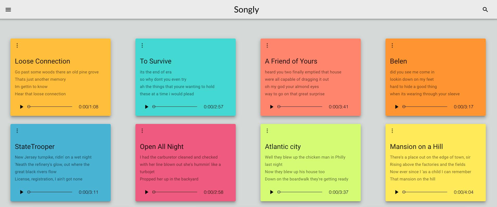
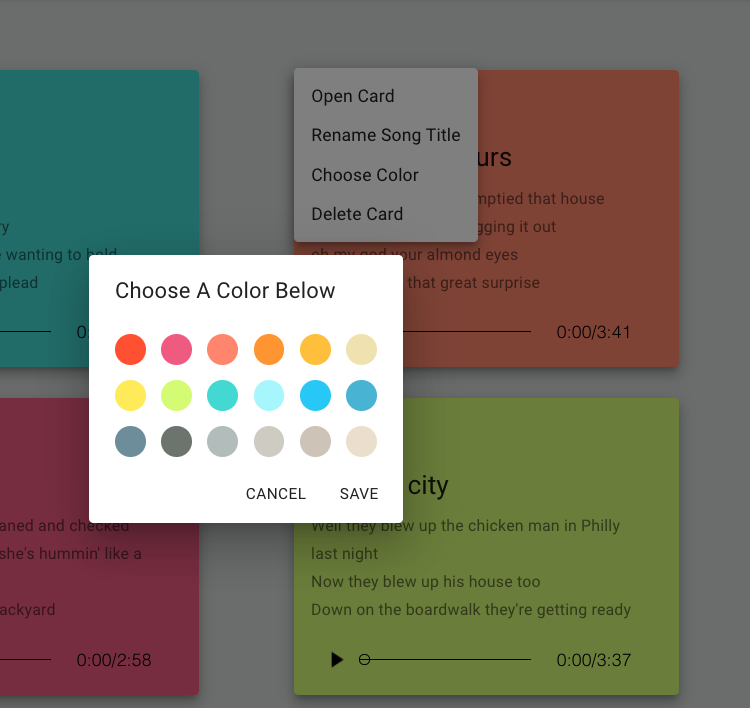
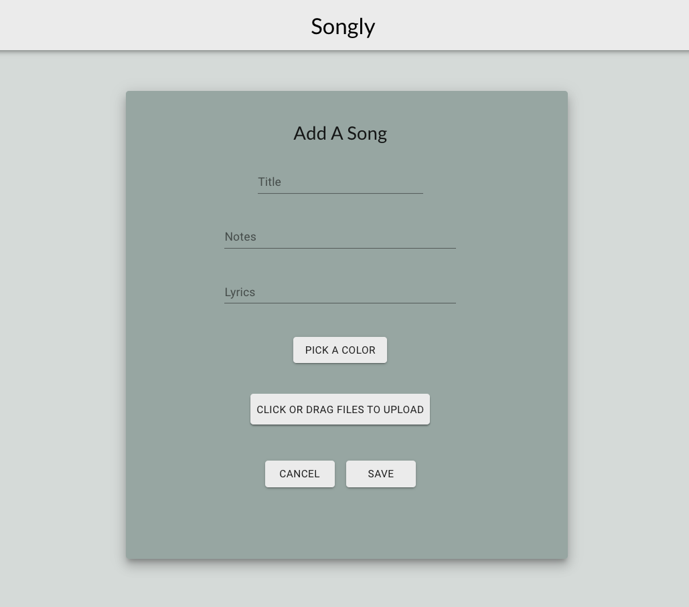
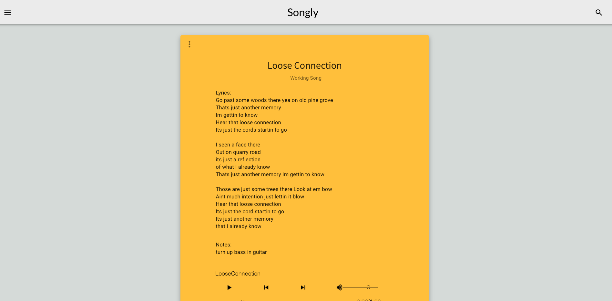
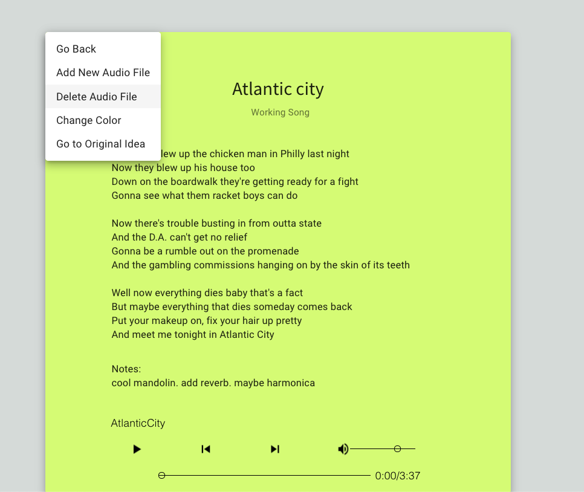
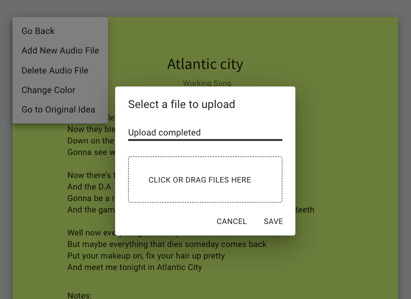
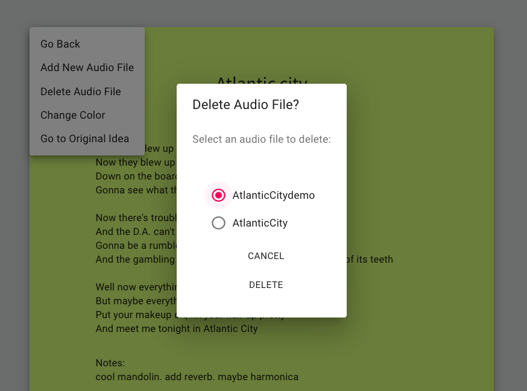

# Solo Project Name 

"Songly"

## Description

Duration: Two week sprint.

This application helps working artists keep track of the circuitous path of the works they create.  More specifically, it helps songwriters organize and track their works-in-progress.  The user's home page centralizes songs entered by the user in bulletin board fashion, where each song acts as a sticky note or card.  Double clicking on the song card allows the user to edit the lyrics, notes or upload/delete audio recordings.  This simple organization and workflow allows the user to quickly make any updates to their songs.   With lyrics and audio recordings centralized in one location with this application, users will better keep track of work, see more progress and complete more songs.

## Screenshots

## Prerequisites

Before you get started, make sure you have the following software installed on your computer:

- [Node.js](https://nodejs.org/en/)
- [PostrgeSQL](https://www.postgresql.org/)
- [Nodemon](https://nodemon.io/)

## Setup Instructions

1. Run the statements in database.sql file. 
2. Open up your editor of choice and run an `npm install`
3. Create a `.env` file at the root of the project and contact the author at: jpmzurk@gmail.com for environment variables or create your own AWS account and bucket and alter the server.js file accordingly. 
4. Run `npm run server` in your terminal
5. Run `npm run client` in your terminal
6. Navigate to `localhost:3000`

## How to Use Songly

The features of Songly are meant to be intuitive.  The main navigation tools are the drawer menu in the upper left hand corner and card pop-up menus.  I used icons that modern users would hopefully recognize.  Too add a song, navigate to upper left drawer and select "Add a Song".  From here the user can enter recognizable song items like: title, lyrics, notes and audio recording.  The user also has the ability to pick the card color by clicking on the color picker in the "Pick A Color".  Saving or Canceling returns the user to the home screen.  Double clicking on any existing card takes the user to the "Working Song Card".  Here the user can edit the title, lyrics or notes by double clicking and then clicking "Save".  To add or delete a file the user may click the vertical more icon in the upper left corner. From here the user may delete a song by selecting "Delete Audio File" and use the radio buttons to delete one song at a time.  Similarly, The user may add one song at a time by selecting "Add New Audio File" and using the Drag and Drop tool (or click on it) to upload a song.  Lastly, a foundational piece of an artist's work is built into the app--a way to remind the user of where the idea originated.  The user may select "Go to Original Idea" and listen to their original audio recording and view their original lyrics.  This feature allows the artist to use the original idea as a source of inspiration if they find themselves stuck at some point in the songwriting process. 

## Features Yet To Be Integrated

This web-specific project will eventually include to the ability to record and edit new audio files with system specified devices.   These are some but not all features for next release:

Ability to place cards in any order.
Ability to place cards anywhere in the browser.
Ability to group songs by album, styles or influences. 

This project will inevitably evolve into a react-native iOS project with the ability to record and edit new audio recordings directly. 

## Built With

Javascript, React, Node.js, Express.js, AWS S3, PostgreSQL, Material-UI, HTML5, CSS, Passport, Redux, Redux-Sagas, Axios, React-Color, React-Dropzone-S3-Uploader, React-Hook-Form, React-Modular-Audio-Player.

## Acknowledgements

- I would like to thank [Prime Digital Academy](https://github.com/PrimeAcademy) for the opportunity to put my skills into action with a real world project. 
- A special thanks to my instructors, Dane Smith and Kris Szafranksi, for providing the tools and knowledge to build this application.

## Support:

If you have suggestions or issues, please contact me at jpmzurk@gmail.com